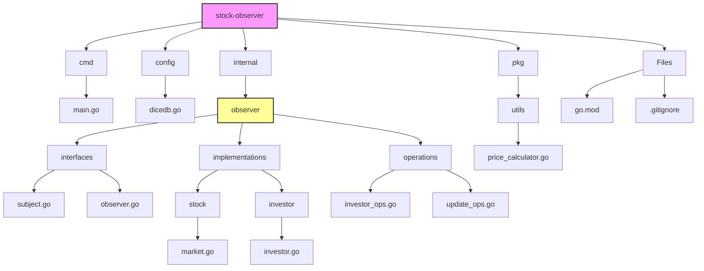

# Stock Observer Pattern with DiceDB

A **Go** project showcasing the **Observer Design Pattern** with real-time stock price updates stored in [DiceDB](https://github.com/dicedb/dicedb-go). Investors (observers) are notified when the stock price changes beyond their thresholds.

## Table of Contents

- [Overview](#overview)
- [System Architecture](#system-architecture)
- [Project Structure](#project-structure)
- [Key Components](#key-components)
- [Setup and Usage](#setup-and-usage)
- [DiceDB Integration](#dicedb-integration)


---

## Overview

1. **Users** can create investors with a specific threshold and store them in DiceDB.  
2. **Investors** can subscribe to the stock market. When a stock's price changes beyond an investor's threshold, a notification is sent.  
3. **Stock prices** and **price history** are stored in DiceDB.  
4. **Concurrency**: We use goroutines to process stock updates concurrently.

### How It Works

1. **Create Investor**: The user enters an investor's name, threshold, and type. A 6-digit ID is generated and stored in DiceDB.  
2. **Subscribe Investor**: The user lists all investors and chooses one by ID. The selected investor is registered as an observer.  
3. **Update Stock**: The user can input stock updates (symbol and price). If the price change (compared to the old price) exceeds the **global threshold** or needs checking for **investor threshold**, observers get notified. The price is stored in DiceDB, and the previous price is used to calculate percentage change.

## System Architecture

Below is a Mermaid diagram illustrating the system's high-level flow:

```mermaid
flowchart TB
    A[Create Investor] --> B{Store in DiceDB <br> "investor:<ID>"}
    B --> C[Generate 6-digit ID]

    D[Subscribe Investor] --> E[Load investor from DiceDB <br> if not in memory]
    E --> F[RegisterObserver(investor)]

    G[SetStockPrice(symbol, newPrice)] --> H[Get oldPrice from <br> DiceDB "stock:<symbol>"]
    H --> I[Compare with newPrice <br> and compute %change]
    I --> J{If priceChange >= threshold?}
    J -- No --> K[Just store newPrice]
    J -- Yes --> L[NotifyObservers()]
    L --> M[Observers Update()]

    K --> N[LPUSH history <br> "history:<symbol>"]
    L --> N

    style A fill:#f99,stroke:#333,stroke-width:1px
    style G fill:#9f9,stroke:#333,stroke-width:1px
    style D fill:#9ff,stroke:#333,stroke-width:1px
```

## Project Structure

Here's the project's directory structure:



## Key Components

1. **Investor (Observer)**
   * Maintains its own `ID`, `Name`, `Threshold`, and `Type`
   * Implements the `Observer` interface (`Update` & `GetID`)

2. **StockMarket (Subject)**
   * Keeps a list (map) of `observers`
   * `RegisterObserver`, `RemoveObserver`, `NotifyObservers`, `SetStockPrice`
   * Stores and loads price data from DiceDB using keys like `"stock:<symbol>"` and `"history:<symbol>"`

3. **investor_ops.go**
   * Functions for creating investors (`CreateInvestorFlow`), listing them, and subscribing them to the `StockMarket`
   * Generates a **6-digit ID** and uses `HSET`/`SADD` to store investor info in DiceDB

4. **update_ops.go**
   * Manages concurrency for reading user input (`ReadInputs`) and processing stock updates (`ProcessUpdates`)

5. **main.go**
   * Presents a menu with choices to **create investor**, **subscribe investor**, or **update stock** concurrently

## Setup and Usage

1. **Create an Investor**:
   ```bash
   # Follow the prompts to enter:
   - Investor name
   - Threshold value
   - Investor type
   ```

2. **Subscribe to Updates**:
   ```bash
   # Steps:
   1. View list of available investors
   2. Enter investor ID to subscribe
   3. Receive confirmation
   ```

3. **Update Stock Prices**:
   ```bash
   # Concurrent updates:
   - Enter stock symbol
   - Enter new price
   - System notifies subscribed investors
   ```

## DiceDB Integration

The system uses DiceDB for:
- Storing investor information (`HSET`)
- Maintaining sets of investors (`SADD`)
- Storing current stock prices (`SET`)
- Maintaining price history (`LPUSH`)

### Key Patterns:
- `investor:<ID>` - Hash storing investor details
- `investors` - Set containing all investor IDs
- `stock:<symbol>` - String storing current price
- `history:<symbol>` - List storing price history

## Dependencies

- Go 1.23.0 or higher
- DiceDB client
- Context package for cancellation
- Standard library packages:
  - fmt
  - math/rand
  - strconv
  - time

## Contributing

Contributions are welcome! Please ensure your code follows the existing patterns and includes appropriate tests.


